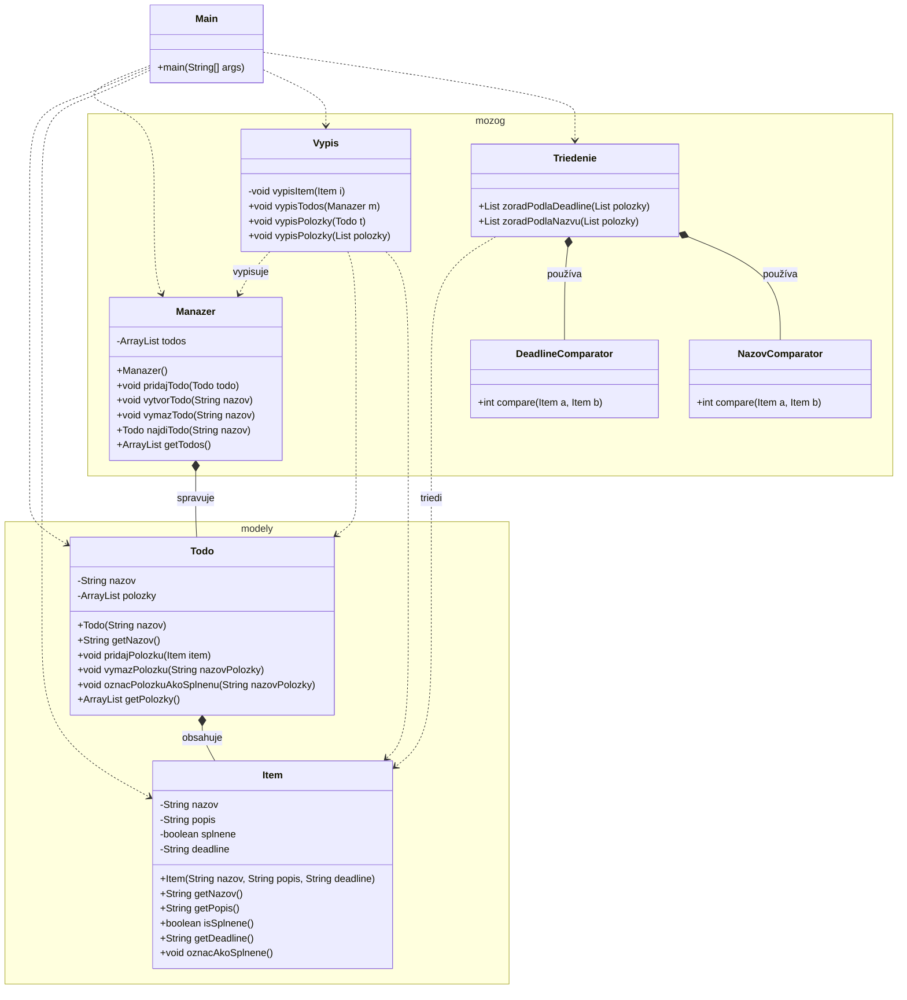
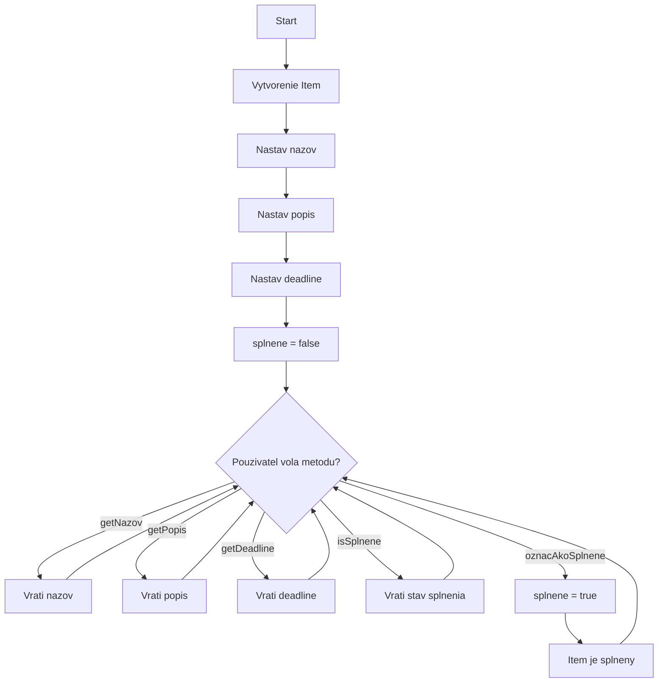

# projektik-opg-durk-hudak-humi

---

## Popis balíčkov a tried

### `modely`
Obsahuje dátové triedy aplikácie.

- **Item** – reprezentuje jednu položku TODO
- **Todo** – reprezentuje jeden TODO zoznam (obsahuje viac položiek)

---

### `mozog`
Obsahuje aplikačnú logiku a analytiku.

- **Manazer** – správa viacerých TODO zoznamov
- **Triedenie** – triedenie položiek podľa názvu alebo deadline
- **Vypis** – výpis TODO zoznamov a položiek

---

### `Main`
Vstupný bod aplikácie, slúži na testovanie funkcionalít aplikácie.

---

## Použité technológie

- Java
- OOP princípy
- Kolekcie (`List`)

---
## Diagramy
### UML Class Diagram

### Flowchart Item.java

## Poznámky

Projekt je určený ako školské zadanie / cvičný projekt. Neobsahuje grafické rozhranie ani ukladanie dát do súborov alebo databázy.

---

## Autori

Projekt vytvorený tímovou spoluprácou (Šimon Durkáč, Dávid Hudák ft. Tomáš Humeňaj).

## Špeciálne poďakovanie

