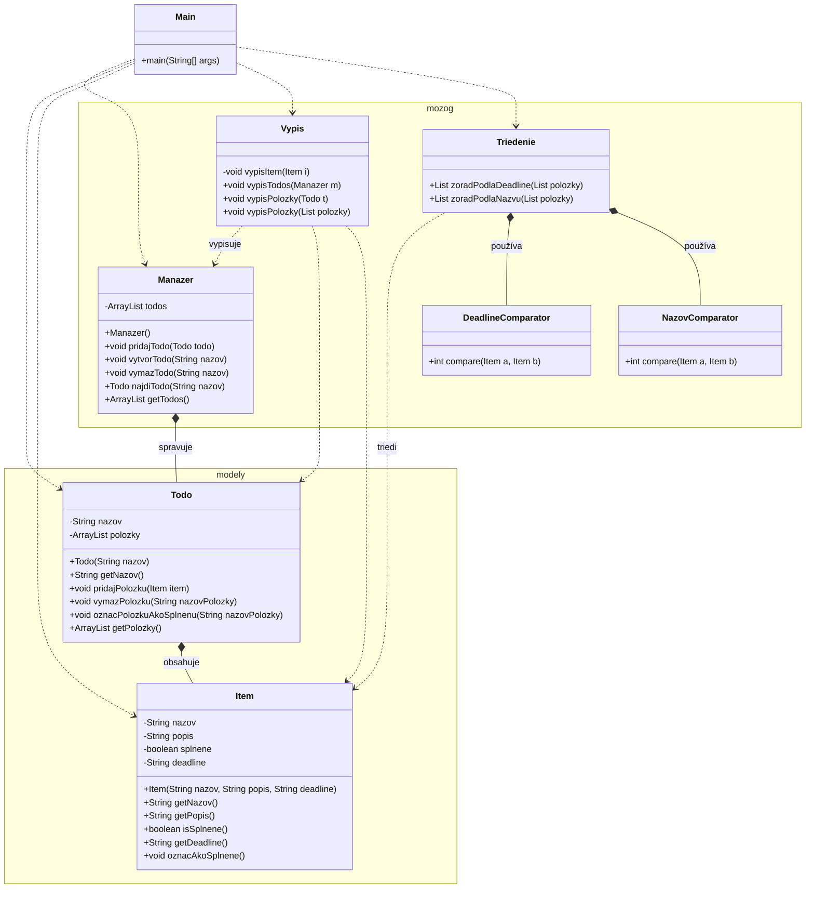

# projektik-opg-durk-hudak-humi

---

## Popis balíčkov a tried
### `data`
Obsahuje textové súbory

---

### `modely`
Obsahuje dátové triedy aplikácie.

- **Item** – reprezentuje jednu položku TODO
- **Todo** – reprezentuje jeden TODO zoznam (obsahuje viac položiek)

---

### `mozog`
Obsahuje aplikačnú logiku a analytiku.

- **Manazer** – správa viacerých TODO zoznamov
- **Triedenie** – triedenie položiek podľa názvu alebo deadline
- **UkladacDat** – ukladanie dát
- **Vypis** – výpis TODO zoznamov a položiek

---

### `Application`
Trieda zodpovedná za spustenie JavaFX aplikácie, načítanie používateľského rozhrania a zobrazenie hlavného okna.

---

### `Controller`
Riadi komunikáciu medzi používateľským rozhraním a aplikačnou logikou, spracováva používateľské akcie a aktualizuje zobrazené údaje.

---

### `Main`
Vstupný bod aplikácie, slúži na testovanie funkcionalít aplikácie.

---

## Použité technológie

- Java
- OOP princípy
- Kolekcie (`List`)
- JavaFX

---
## Diagramy
### UML Class Diagram

```mermaid
classDiagram

namespace modely {

    class Item {
        -String nazov
        -String popis
        -boolean splnene
        -String deadline

        +Item(String nazov, String popis, String deadline)
        +String getNazov()
        +String getPopis()
        +boolean isSplnene()
        +String getDeadline()
        +void oznacAkoSplnene()
    }

    class Todo {
        -String nazov
        -ArrayList<Item> polozky

        +Todo(String nazov)
        +String getNazov()
        +void pridajPolozku(Item item)
        +void vymazPolozku(String nazovPolozky)
        +void oznacPolozkuAkoSplnenu(String nazovPolozky)
        +ArrayList<Item> getPolozky()
    }
}

namespace mozog {

    class Manazer {
        -ArrayList<Todo> todos

        +Manazer()
        +void pridajTodo(Todo todo)
        +void vytvorTodo(String nazov)
        +void vymazTodo(String nazov)
        +Todo najdiTodo(String nazov)
        +ArrayList<Todo> getTodos()
    }

    class Triedenie {
        +List<Item> zoradPodlaDeadline(List<Item> polozky)
        +List<Item> zoradPodlaNazvu(List<Item> polozky)
    }

    class DeadlineComparator {
        +int compare(Item a, Item b)
    }

    class NazovComparator {
        +int compare(Item a, Item b)
    }

    class Vypis {
        -void vypisItem(Item i)
        +void vypisTodos(Manazer m)
        +void vypisPolozky(Todo t)
        +void vypisPolozky(List<Item> polozky)
    }
}

class Main {
    +main(String[] args)
}

Todo *-- Item : obsahuje
Manazer *-- Todo : spravuje

Triedenie ..> Item : triedi
Triedenie *-- DeadlineComparator : používa
Triedenie *-- NazovComparator : používa

Vypis ..> Manazer : vypisuje
Vypis ..> Todo
Vypis ..> Item

Main ..> Manazer
Main ..> Todo
Main ..> Item
Main ..> Vypis
Main ..> Triedenie
```
### Flowchart pre pridávanie polozky do todo
```mermaid
flowchart TD

A([Start: pridajPolozku]) --> B[Získaj vybraný TODO zoznam]
B --> C{Je TODO null?}

C -->|Áno| D[Nastav správu: "Najprv vyber TODO zoznam"]
D --> Z([End])

C -->|Nie| E[Načítaj názov, popis a deadline]
E --> F{Je názov prázdny?}

F -->|Áno| G[Nastav správu: "Zadaj názov položky"]
G --> Z

F -->|Nie| H[Vytvor nový Item]
H --> I[Pridaj položku do TODO]
I --> J[Vyčisti vstupné polia]
J --> K[Obnov zobrazenie položiek]
K --> L[Nastav správu: "Položka pridaná"]
L --> Z
```

## Poznámky

Projekt je určený ako školské zadanie / cvičný projekt. Obsahuje grafické rozhranie a ukladanie dát do súborov alebo databázy.

---

## Autori

Projekt vytvorený tímovou spoluprácou (Šimon Durkáč, Tomáš Humeňaj ft. Dávid Hudák).

## Špeciálne poďakovanie

